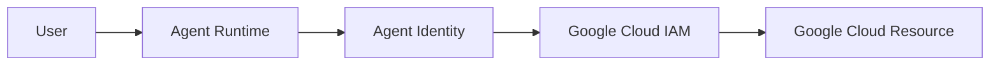
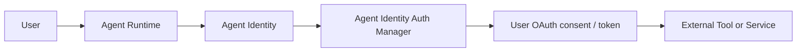
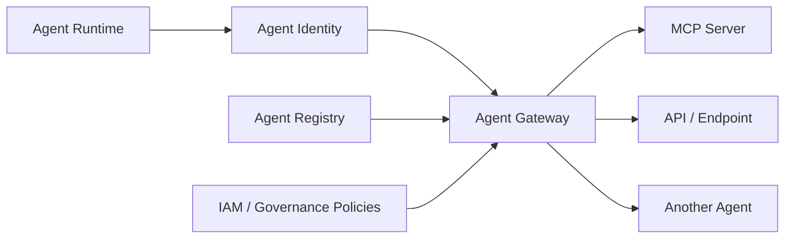

# Reference architecture

This reference separates three concerns that are often mixed together in enterprise agent designs:

1. the identity of the human user,
2. the identity of the agent,
3. the authority used to access a downstream resource.

The diagrams below show three common patterns on Google Cloud.

## Pattern 1 — agent accesses Google Cloud using its own identity

In this pattern, the downstream resource trusts the **agent itself**.

The agent receives its own managed Agent Identity, and IAM determines what that specific agent is allowed to access.

This is a strong default for machine-to-machine access because permissions can be assigned at the individual agent level rather than through a shared service identity.

---

## Pattern 2 — agent acts on behalf of a user

Here, the external service needs the authorization of the **specific user**, not only the identity of the agent.

The agent keeps its own Agent Identity while Auth Manager handles the delegated authentication required by the target service.

This preserves an important distinction:

- the user authorizes the action,
- the agent executes the action,
- the delegated credential defines the permitted user-level access.

---

## Pattern 3 — governed access to tools and agents

In this pattern, Agent Gateway acts as the enforcement point for governed agent communication.

The agent's identity can be evaluated against policies before access to registered tools, MCP servers, endpoints, or other agents is allowed.

## My design principle

The architecture should answer two separate questions for every downstream call:

> **Which agent is making the request?**

and

> **Whose authority should the target operation use?**

Those questions should not be treated as interchangeable.

Agent Identity establishes the agent as a distinct security principal.

Delegated user authority should be added only when the downstream system genuinely needs the authorization context of a specific user.

Agent Gateway adds another control layer where agent-to-resource communication needs centralized governance and policy enforcement.

## Scope

These diagrams are conceptual reference patterns based on publicly documented Google Cloud capabilities.

They are not intended to prescribe a single topology for every enterprise implementation.