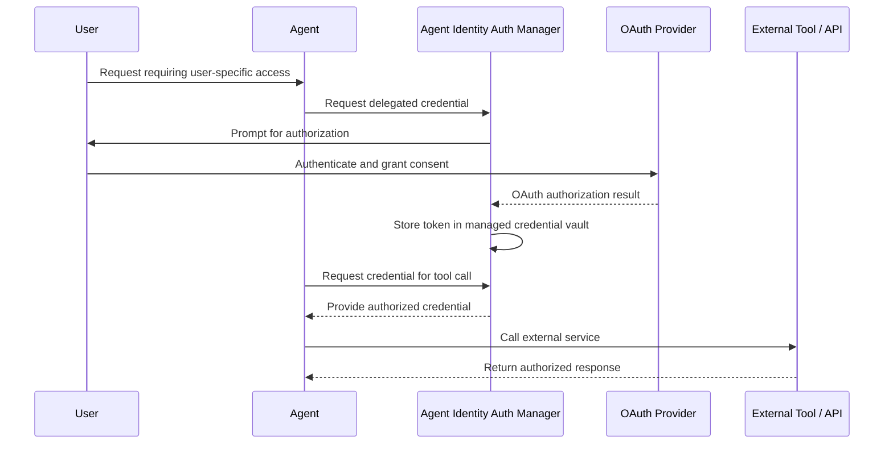

# User-delegated OAuth with Agent Identity

Some agent workflows need access to an external service using the authority of a specific end user.

In these cases, the agent should not become the user. The system should keep the **user identity**, **Agent Identity**, and **delegated authority** as separate concepts.

## When to use this pattern

Use user-delegated OAuth when the downstream service must make an authorization decision based on the specific user.

Examples include:

- accessing user-specific records in a SaaS application,
- invoking an external API where permissions differ by user,
- performing an action that requires explicit user consent.

If the downstream resource should trust the agent itself instead, use Agent Identity without user delegation.

## Identity model

The flow involves two separate identities:

- **User identity** — the person who authorizes access
- **Agent Identity** — the agent that executes the action

The delegated OAuth credential defines what the agent is allowed to do on behalf of that user.

## High-level flow

## Google Cloud implementation

Google Cloud Agent Identity Auth Manager supports 3-legged OAuth for scenarios where an agent needs to access an external tool or service on behalf of an end user.

Using the current **Agent Identity API** path, Auth Manager handles key parts of the OAuth lifecycle, including:

- user consent and redirection,
- authorization-code exchange,
- secure token storage,
- credential retrieval,
- token refresh where supported.

This reduces the need for the agent application to build and operate its own OAuth credential-management layer.

## Current API path

For new implementations, use the **Agent Identity API**.

Google Cloud recommends this path for Agent Identity Auth Manager.

The older **IAM Connectors API** is a legacy Preview API and is not planned for General Availability.

## What I would avoid

### Passing OAuth tokens through prompts

User credentials should never become part of the model's conversational context.

### Giving the agent permanent user credentials

Delegated access should be scoped to the authorization granted by the user and managed through the platform's credential-management capabilities.

### Building a custom token store by default

If the platform already provides managed OAuth lifecycle and credential storage, introducing another token store adds unnecessary security and operational responsibility.

### Using delegated authority when it is not required

Delegation should exist because the downstream system requires the user's authorization context.

It should not be introduced merely because a user started the conversation.

## Design principle

My decision rule is:

> Use delegated OAuth only when the downstream system needs to authorize the specific user.

The agent should retain its own Agent Identity so the architecture can distinguish:

- who authorized the operation,
- which agent executed it,
- and what delegated authority was used against the target service.

## Current capability status

As of September 2026:

- Agent Identity Auth Manager — Generally Available
- Agent Identity API — Generally Available
- Agent Identity Credentials API — Generally Available
- IAM Connectors API — Preview and not planned for General Availability

New implementations should use the Agent Identity API path.

## Official references

Google Cloud — Agent Identity Auth Manager:

https://docs.cloud.google.com/iam/docs/auth-manager-overview

Google Cloud — 3-legged OAuth using the Agent Identity API:

https://docs.cloud.google.com/iam/docs/auth-with-3lo-v2

Google Cloud — IAM release notes:

https://docs.cloud.google.com/iam/docs/release-notes